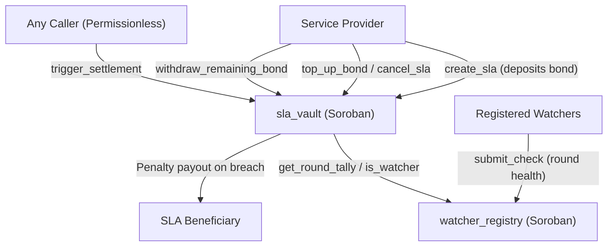

<div align="center">


# SLASettle Vault

Soroban smart contracts for bonded service-level agreements on Stellar.

[](https://github.com/SLASettleHQ/slasettle-vault/actions/workflows/ci.yml)
[](LICENSE)
[](https://stellar.org)
[](https://soroban.stellar.org)
[](evidence/testnet-2026-10-01.md)
[](https://github.com/SLASettleHQ/slasettle-vault/tree/main)

[Documentation](https://slasettle-docs.vercel.app) · [SLASettle Hub](https://github.com/SLASettleHQ/slasettle-hub) · [Live App](https://slasettle-web.vercel.app) · [Testnet Contracts](#currently-deployed-on-testnet) · [Deployment Evidence](evidence/testnet-2026-10-01.md) · [Security](SECURITY.md) · [Contributing](CONTRIBUTING.md)

</div>

---

## What is SLASettle Vault?

SLASettle Vault contains the Soroban smart contracts that power the SLASettle protocol on Stellar. It provides the on-chain financial guarantees and verification logic needed to hold service providers accountable to their uptime commitments:

- **`watcher_registry`**: Manages an authorized set of independent watchers and tallies their votes on whether monitored service endpoints were operational during discrete observation rounds.
- **`sla_vault`**: Escrows provider bond deposits, evaluates watcher consensus against configured SLA thresholds, and disburses penalty payouts to designated beneficiaries when downtime breaches are confirmed.

## Why it exists

Traditional SLAs rely on retroactive manual claims processes, proprietary provider dashboards, and opaque outage calculations. Providers hold all customer funds while customers bear the burden of proving service failure.

SLASettle replaces manual claims with on-chain guarantees:
- Providers lock real token bonds before agreements take effect.
- Independent watcher nodes monitor endpoint availability round by round.
- Breach penalties are paid out directly from the bond when watcher consensus confirms a failure.
- Contract rules are public, deterministic, and verifiable on Stellar.

## Current Testnet status

| Item | Details | Status |
|---|---|---|
| Target Network | Stellar Testnet (`https://soroban-testnet.stellar.org`) | Connected |
| Stellar Protocol | Protocol 28 | Verified |
| Soroban SDK | 28.0.0 | Pinned |
| `watcher_registry` | `CDRNXUPCZTVZXKPWNBQZAYI6HYFNBDHRO2KNNJSMDVTEHFOM7LCMOYMF` | [Explorer](https://stellar.expert/explorer/testnet/contract/CDRNXUPCZTVZXKPWNBQZAYI6HYFNBDHRO2KNNJSMDVTEHFOM7LCMOYMF) |
| `sla_vault` | `CDBFPYHJNYSIFXSMXF3BBDWPKHRS7SJFFEKMQ5WJXYTBMD4LFAG2CHLN` | [Explorer](https://stellar.expert/explorer/testnet/contract/CDBFPYHJNYSIFXSMXF3BBDWPKHRS7SJFFEKMQ5WJXYTBMD4LFAG2CHLN) |
| WASM Bytecode Parity | Local build matches deployed bytecode byte-for-byte | Verified (Phase 8) |
| Automated Tests | 52 passing workspace unit and cross-contract tests | Passing |
| Third-Party Audit | Formal external security audit | Not performed |

## Contracts

### `watcher_registry`

Tracks an eligible set of watchers and records their binary votes (up or down) on endpoint health per round.
- Does not enforce quorum thresholds; it only counts votes.
- Rejects duplicate votes from the same watcher in the same round.
- Requires admin authentication for registration, removal, and pausing.
- Authoritative for watcher membership and vote counts.

### `sla_vault`

Holds the provider's token bond and evaluates breach conditions.
- Calls `watcher_registry` to read raw vote tallies.
- Enforces quorum: if the down-vote count meets or exceeds the required threshold, the round is judged breached.
- Disburses a fixed penalty amount to the beneficiary, capped at the remaining bond balance.
- Rejects zero-balance bond withdrawals when an SLA has no active balance remaining.

## How settlement works

```
Observation Round
      │
      ▼
Watchers check endpoint ───► submit_check (watcher_registry)
                                      │
                                      ▼
Breach detected? ──────────► trigger_settlement (sla_vault)
                                      │
                                      ▼
                        Reads tally from watcher_registry
                                      │
                                      ▼
                        Quorum reached?
                         ├── YES ──► Pay penalty to beneficiary
                         └── NO  ──► No payout
```

Settlement is permissionless: any caller can submit `trigger_settlement` for an eligible round. Neither repository triggers settlement automatically; it must be invoked by an operator, beneficiary, or automated cron once a round closes.

## Architecture



## Verification

| Verification Class | Scope | Evidence |
|---|---|---|
| WASM Bytecode Parity | Byte-for-byte match between local build and deployed contracts | [Phase 8 Toolchain & Deployment](https://github.com/SLASettleHQ/slasettle-hub/blob/main/evidence/phase8-toolchain-deployment-verification-2026-10-07.md) |
| Live Testnet Writes | Create SLA, top-up bond, cancel SLA, withdraw remaining bond | [Phase 7 Live Write Evidence](https://github.com/SLASettleHQ/slasettle-hub/blob/main/evidence/phase7-live-write-verification-2026-10-07.md) |
| Historical Settlement | On-chain settlement payout on Testnet | [Testnet Evidence 2026-10-01](evidence/testnet-2026-10-01.md) |
| Automated Tests | 52 unit and cross-contract integration tests | `cargo test --workspace` |

## Quick start

### Prerequisites

- Rust stable (1.91.0+ required by `soroban-sdk` 28.0.0)
- `wasm32v1-none` target
- `stellar-cli` 28.1.0+

```bash
rustup target add wasm32v1-none
stellar contract build
```

The workspace builds two WASM artifacts:
- `target/wasm32v1-none/release/watcher_registry.wasm`
- `target/wasm32v1-none/release/sla_vault.wasm`

A committed `Cargo.lock` guarantees reproducible WASM compilation hashes.

## Testing

```bash
cargo test --workspace
```

The test suite covers:
- Success-path tests for all contract entrypoints.
- Error-variant tests for all defined custom errors.
- Real cross-contract invocations between `sla_vault` and `watcher_registry` (no mocked interfaces).

## Deploying (testnet)

Deployment order matters: `sla_vault` requires `watcher_registry`'s address upon initialization.

```bash
# 1. Deploy and initialize watcher_registry
REGISTRY_ID=$(stellar contract deploy \
  --wasm target/wasm32v1-none/release/watcher_registry.wasm \
  --source-account <ADMIN> --network testnet)

stellar contract invoke --id $REGISTRY_ID --source-account <ADMIN> \
  --network testnet -- initialize --admin <ADMIN>

# 2. Register initial watchers
stellar contract invoke --id $REGISTRY_ID --source-account <ADMIN> \
  --network testnet -- register_watcher --caller <ADMIN> --watcher <WATCHER_ADDRESS>

# 3. Deploy and initialize sla_vault pointing at the registry
VAULT_ID=$(stellar contract deploy \
  --wasm target/wasm32v1-none/release/sla_vault.wasm \
  --source-account <ADMIN> --network testnet)

stellar contract invoke --id $VAULT_ID --source-account <ADMIN> \
  --network testnet -- initialize --admin <ADMIN> --watcher_registry $REGISTRY_ID
```

### Currently deployed on Testnet

| Contract | ID | Explorer |
|---|---|---|
| `watcher_registry` | `CDRNXUPCZTVZXKPWNBQZAYI6HYFNBDHRO2KNNJSMDVTEHFOM7LCMOYMF` | [View on Stellar Expert](https://stellar.expert/explorer/testnet/contract/CDRNXUPCZTVZXKPWNBQZAYI6HYFNBDHRO2KNNJSMDVTEHFOM7LCMOYMF) |
| `sla_vault` | `CDBFPYHJNYSIFXSMXF3BBDWPKHRS7SJFFEKMQ5WJXYTBMD4LFAG2CHLN` | [View on Stellar Expert](https://stellar.expert/explorer/testnet/contract/CDBFPYHJNYSIFXSMXF3BBDWPKHRS7SJFFEKMQ5WJXYTBMD4LFAG2CHLN) |

WASM hashes (Protocol 28, `soroban-sdk` 28.0.0):
- `watcher_registry`: `5478788ea6c6ae46ddb85c399015139d3b883b7c253dd9abe50e096bf0bcdfb5`
- `sla_vault`: `e177a76f3888575c3c9666689ab905e25a1b3001fb4d85045d05ee43fa298bcd`

The authoritative record for the current deployment is [evidence/testnet-2026-10-01.md](evidence/testnet-2026-10-01.md). Superseded deployment records are retained in `evidence/` for historical continuity.

## Continuous integration

`.github/workflows/ci.yml` runs on every push and pull request against `main`:
- `stellar contract build`
- `cargo check --workspace`
- `cargo test --workspace`
- `cargo clippy --workspace --all-targets --all-features`
- `cargo fmt --check` (informational)

Branch protection requires pull requests and passing `check, test, build` CI status checks. Required approving reviews are currently set to 0 for small-team velocity. Protection is not enforced for repository administrators (`enforce_admins` is off), allowing direct administrative resolution if required.

Dependabot (`.github/dependabot.yml`) checks `cargo` and `github-actions` weekly.

## Security

See [`SECURITY.md`](SECURITY.md).

**This project has not undergone an independent third-party security audit.**

- The authorization model enforces role-based checks on sensitive admin and provider operations (`require_auth`).
- `trigger_settlement` is deliberately permissionless so any party can execute a valid settlement.
- Known security limitations are documented below.

## Known limitations

1. **No commit-reveal vote protection**: Contract state is public; a late-voting watcher could observe earlier votes and copy the majority. A commit-reveal scheme is planned for a future upgrade.
2. **Display-only uptime target**: `uptime_target_bps` is stored for agreement display; settlement is per-round based on fixed penalty amounts, not automated monthly aggregate calculations.
3. **Shared watcher set**: A single registry-wide watcher set serves all SLAs in this deployment; provider-curated watcher sets are not supported in v1.
4. **Operational TTL extension**: Contracts do not extend instance storage lifetimes automatically in code; rent/TTL must be monitored and renewed operationally.

Full interface specifications and authorization rules are detailed in [`SLASettle-contract-spec.md`](SLASettle-contract-spec.md).

## Contributing

See [`CONTRIBUTING.md`](CONTRIBUTING.md).

## License

This project is licensed under the [MIT License](LICENSE).
